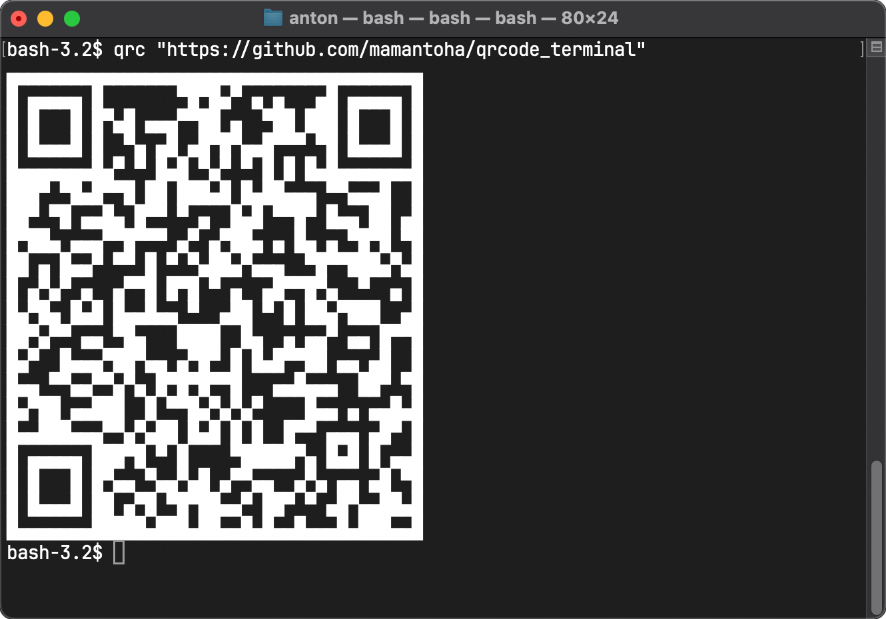

# QRCode Terminal

[](https://github.com/mamantoha/qrcode_terminal/actions/workflows/crystal.yml)
[](https://github.com/mamantoha/qrcode_terminal/releases)
[](https://github.com/mamantoha/qrcode_terminal/blob/master/LICENSE)

QRCodes, in the terminal.

## Installation

1. Add the dependency to your `shard.yml`:

   ```yaml
   dependencies:
     qrcode_terminal:
       github: mamantoha/qrcode_terminal
   ```

2. Run `shards install`

## Usage

```crystal
require "qrcode_terminal"

puts QRCodeTerminal.generate("https://github.com/mamantoha/qrcode_terminal")
```

```
▄▄▄▄▄▄▄▄▄▄▄▄▄▄▄▄▄▄▄▄▄▄▄▄▄▄▄▄▄▄▄▄▄▄▄▄▄▄▄
█ ▄▄▄▄▄ █       ▀█▀█▄▀ ▄ ▄   ▄█ ▄▄▄▄▄ █
█ █   █ █▀▄█ ▄▄▄▀▀██ ▄  ▀██ ███ █   █ █
█ █▄▄▄█ █  ▀▄ ▄█ ▄█▀█▀▄▄█▀▀▀ ▀█ █▄▄▄█ █
█▄▄▄▄▄▄▄█▄▀ ▀ █▄█ ▀▄▀ ▀ █ █ █▄█▄▄▄▄▄▄▄█
███▀ ▀█▄█▀▀█ ██ ███▄█ █▄██▄▄▄ ▀▀▄▄▄█  █
██▀ ▀█ ▄▄█▄ █▀▀ ▀ ▄  █▄█ ▀▀█▀ █▄▄ ██ ▄█
█▀██▄ ▄▄▄▀▀█▀▀▀ ▄▀ ▄▀██▄ ▄ █▄ ▄ ▀█▀█ ▀█
██ ▄ █▄▄▀ ▀▀ █ ▀ ▀▄██▄▀▄▄▄  ▀█▀▀███▄▀▄█
█ ▄▀▄▀ ▄  ▄▀▀█ █▀█ ▀ ▄  ▄█▀▀█▀▄  ▀  ▄ █
█▄▀█▄ █▄█ █▄▄█▄▄ ▀  ▄██ ▀ █ ██▄▀███  ▄█
██▀▄▀▀ ▄▄ ▀█▄   ████  █▄  ▄ ▄▄▀ ▄▄ █▀▀█
█▄▀  █▄▄▄▀██▀▄▄ ▄▀█▀ █ █▄█▀▀██ ▄▄ ▄█  █
█▄▄ ▀▀▄▄▀▀▄▀▄ █▀█▀█▀▀█   ▄▄█▄▄▄  ██▀ ▀█
█▄▀██ ▄▄███  █ ▀▀█▄▀▄▀▄▀    █▄▄ ▄ ▄▄█▄█
█▄▄███▄▄▄▀▀▄▀▄██ █▄█ █ █  █▀▀ ▄▄▄ ▄█▀ █
█ ▄▄▄▄▄ ███▀█ ▀ █    ▀█████▀▄ █▄█ █ ▄▄█
█ █   █ █▀▄▄ ▀▄▄▀▄█ ▄▀▀▄▄  ▄▀▄ ▄▄ ▄█ ▀█
█ █▄▄▄█ ██ ▄▀█ ▀█▀██▄▄▀ ██▀ ▀ ▄█▀▄▄██▄█
█▄▄▄▄▄▄▄█████▄███▄██▄▄█▄█▄▄█▄▄▄█▄███▄▄█
```

## `qrc`

To create a QR code in ASCII art directly from the terminal, you can use a tool called `qrc`.



### Binaries

The project offers precompiled binary packages for Linux, macOS, and Windows.

You can obtain the standalone binary for `qrc` from the [releases](https://github.com/mamantoha/qrcode_terminal/releases) page, available for download.

## Contributing

1. Fork it (<https://github.com/mamantoha/qrcode_terminal/fork>)
2. Create your feature branch (`git checkout -b my-new-feature`)
3. Commit your changes (`git commit -am 'Add some feature'`)
4. Push to the branch (`git push origin my-new-feature`)
5. Create a new Pull Request

## Contributors

- [Anton Maminov](https://github.com/mamantoha) - creator and maintainer
